# Beacon 架构与流程（Mermaid）

与 [blueprint.md](./blueprint.md) 及 [architecture-plantuml.md](./architecture-plantuml.md)（PlantUML 版）**同构**：模块关系、流水线顺序、数据门禁与读者动线均对齐当前代码。

**如何渲染**：GitHub 预览、VS Code（Markdown 预览 / Mermaid 插件）、Notion、MkDocs（mermaid 插件）等可直接渲染下列 ` ```mermaid ` 块。

---

## 1. 系统上下文

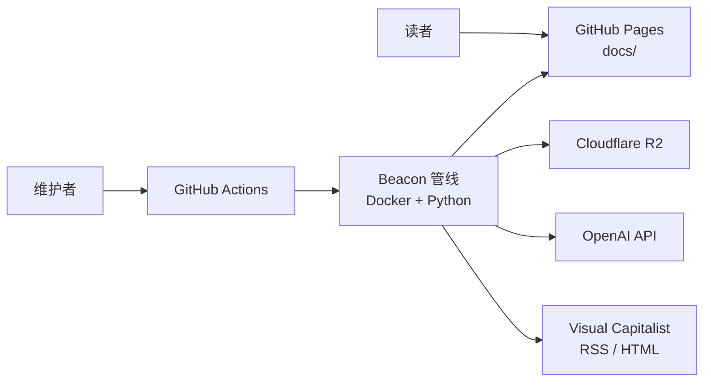

---

## 2. 部署与 CI（Docker + 卷）

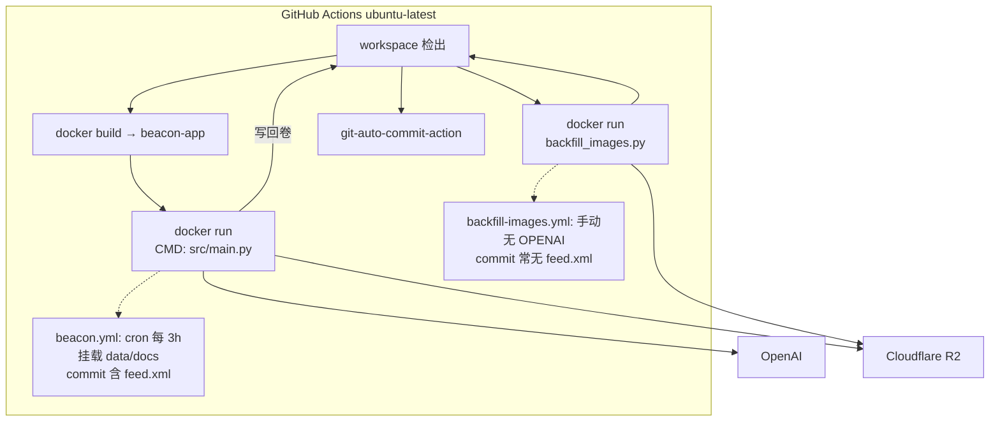

---

## 3. Python 组件依赖

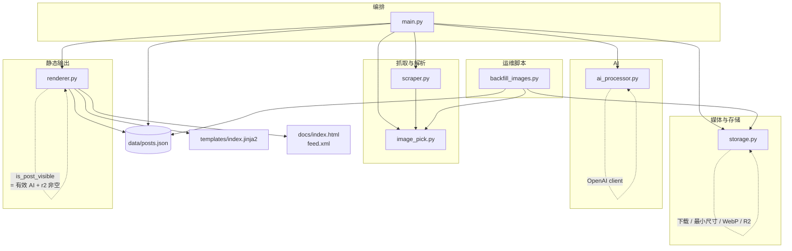

---

## 4. 主管线时序（`main.main`）

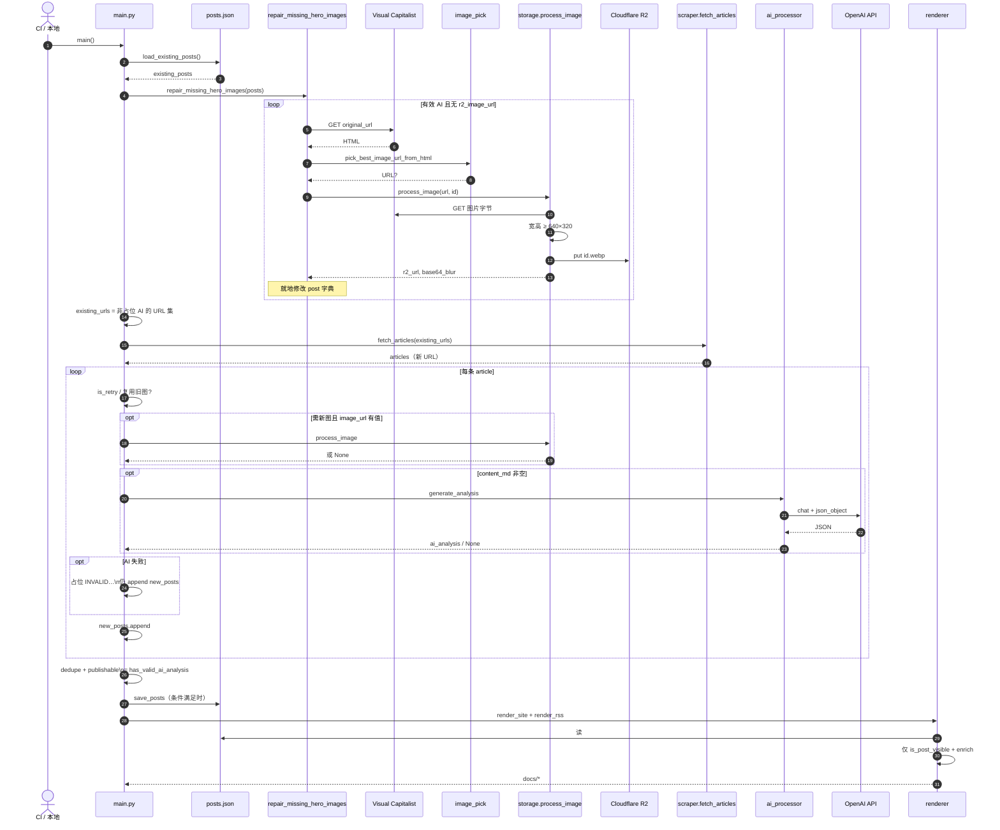

---

## 5. `scraper._get_image_url` 决策

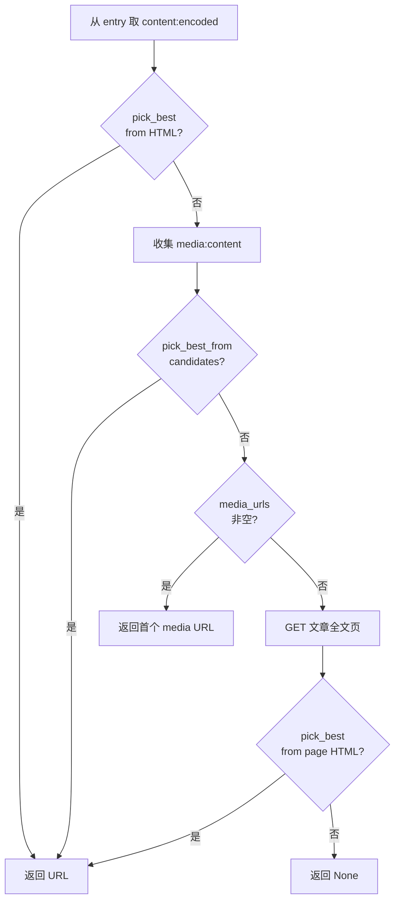

---

## 6. `storage.process_image`

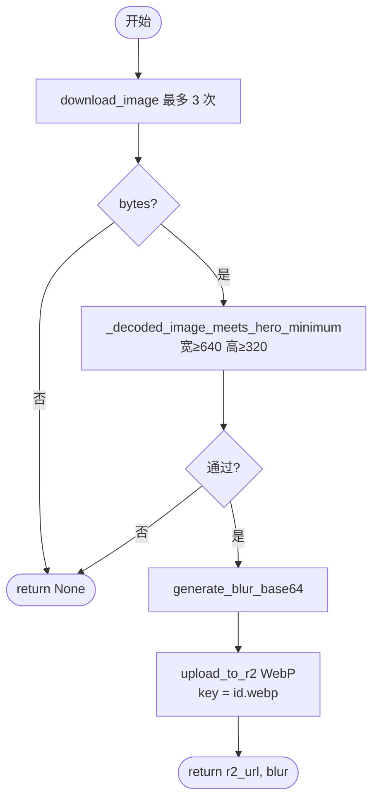

---

## 7. 持久化 vs 展示（两道门禁）

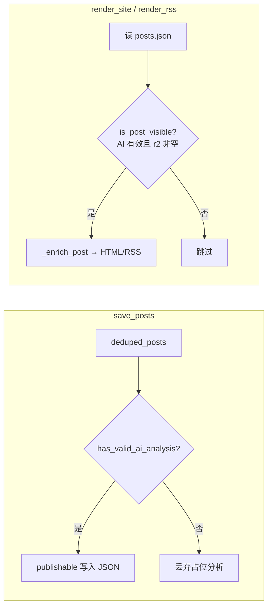

---

## 8. 读者端动线（静态页 + 内联 JS）

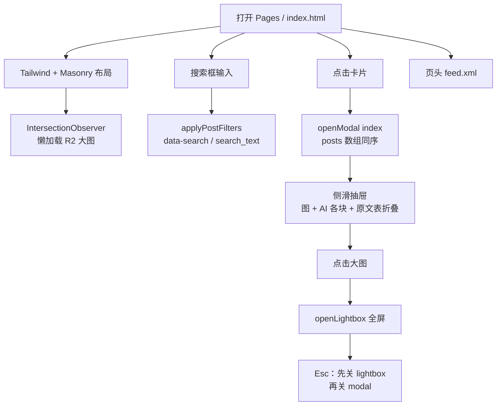

---

## 9. 端到端数据流

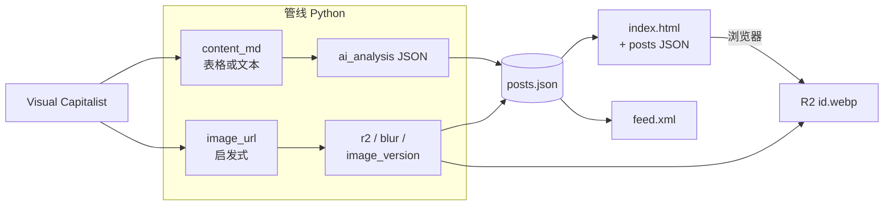

---

## 10. `backfill_images.py` 工作流

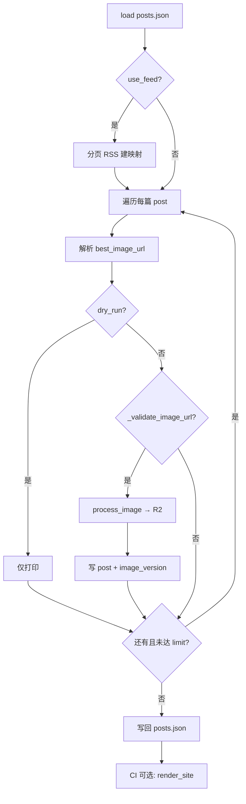

---

## 11. 单帖概念状态

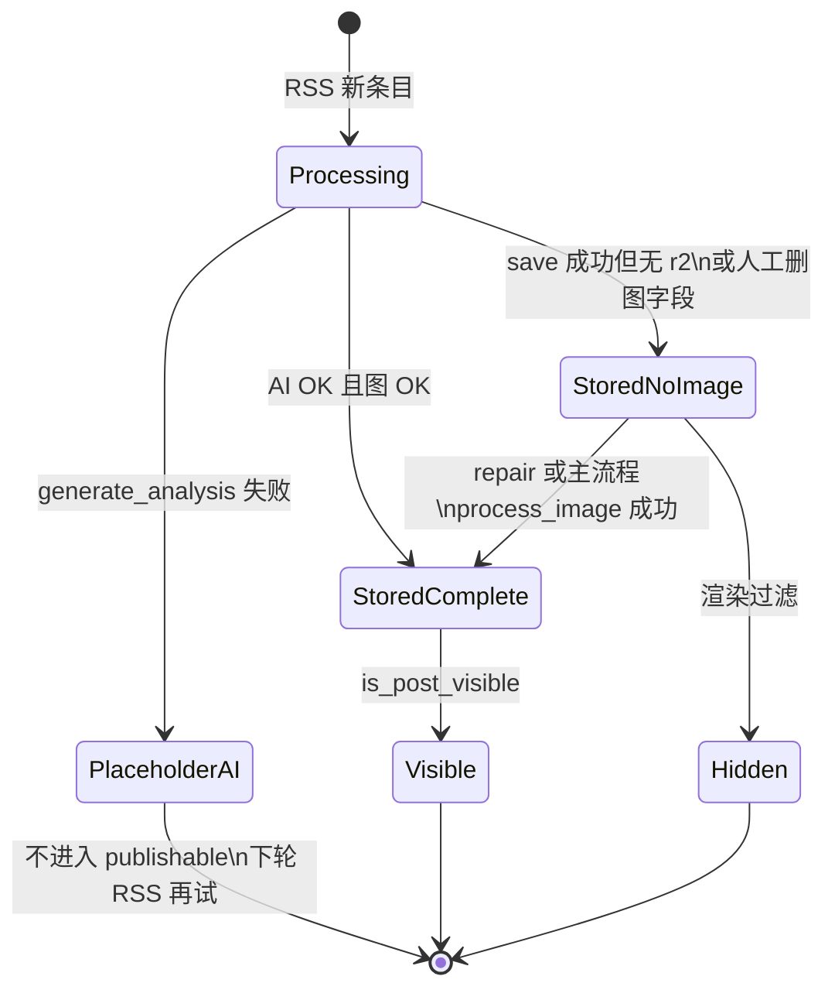

---

## 维护说明

| 变更类型 | 同步更新章节 |
|----------|----------------|
| 新模块 / import | 3、4 |
| 管线顺序或门禁 | 4、7、11 |
| CI / Docker | 2 |
| 前端交互 | 8 |
| 抓取 / R2 / 补图 | 5、6、9、10 |

与 PlantUML 版**择一维护**时，请保持两文档语义一致；或只维护一份并在另一份顶部注明「以 ×× 为准」。
