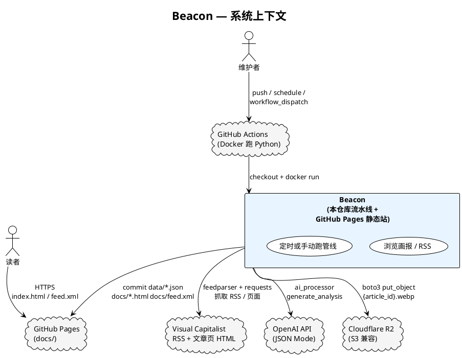
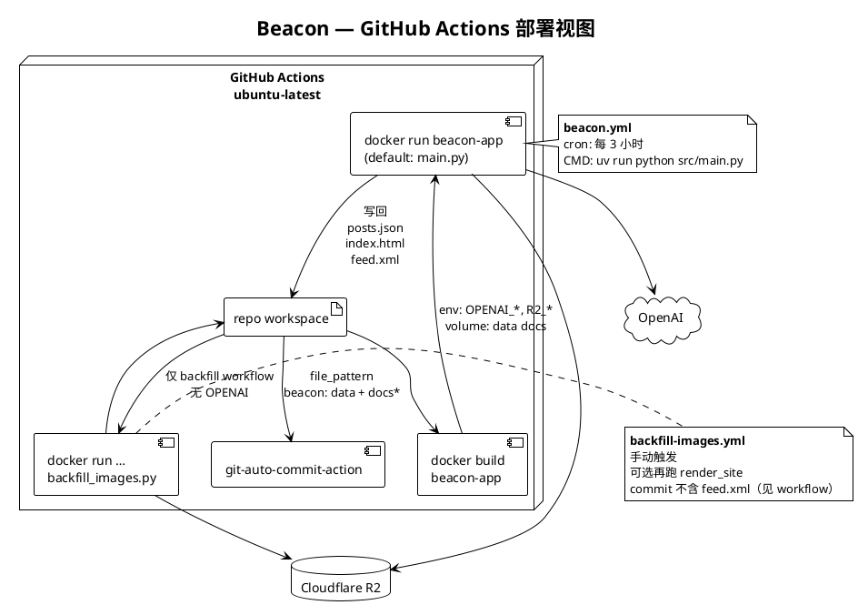
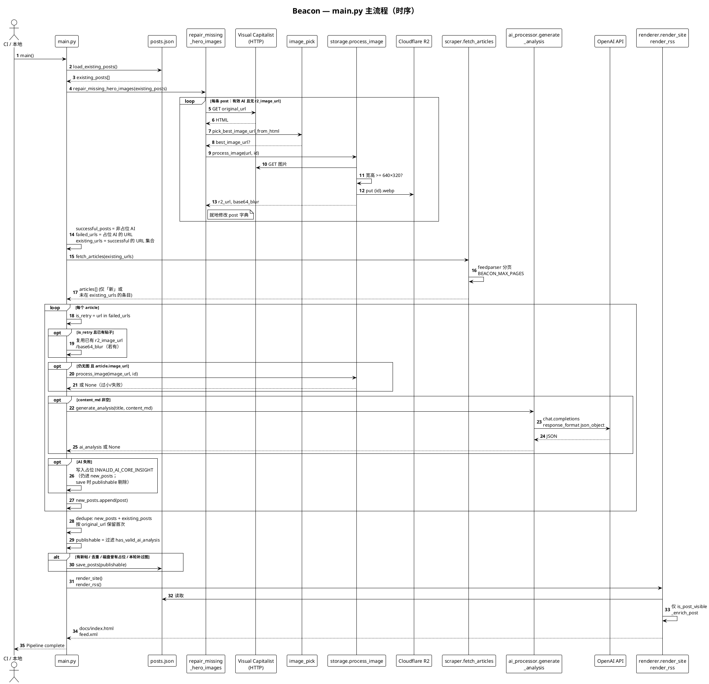
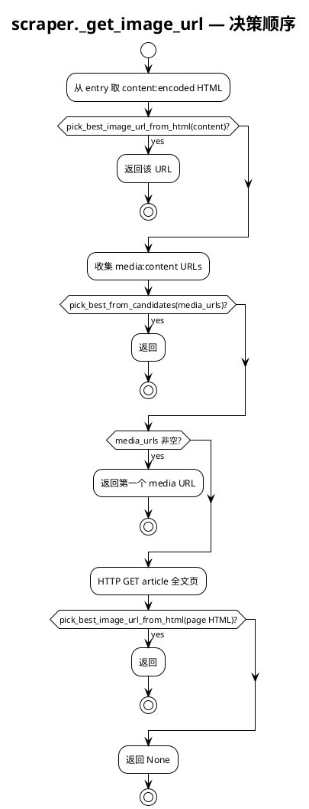
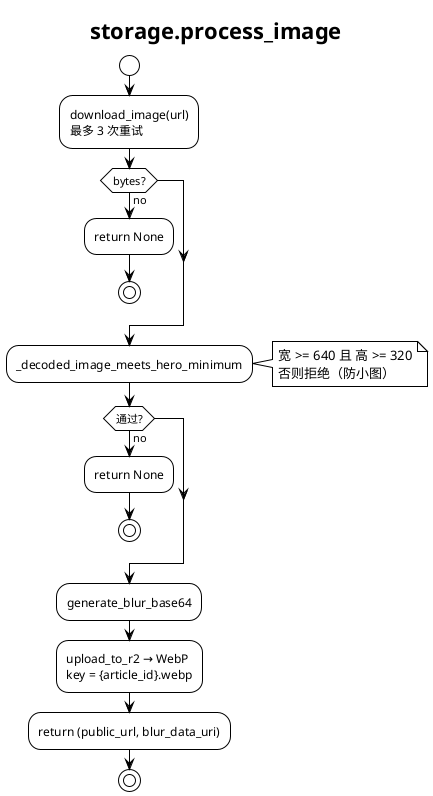
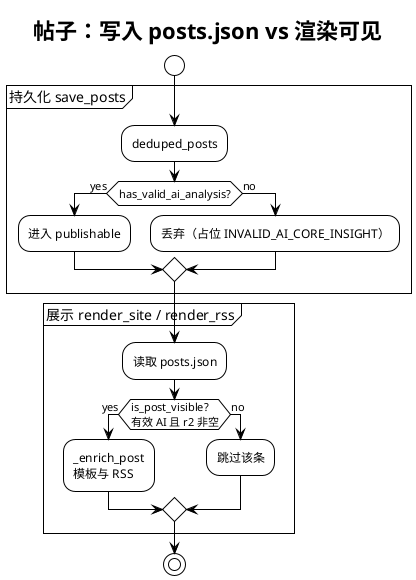
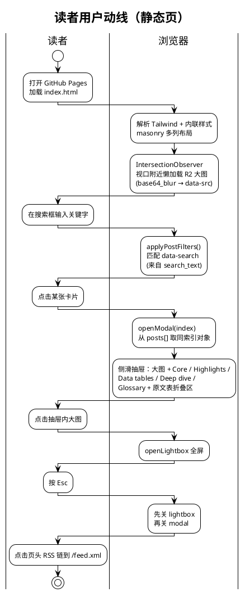
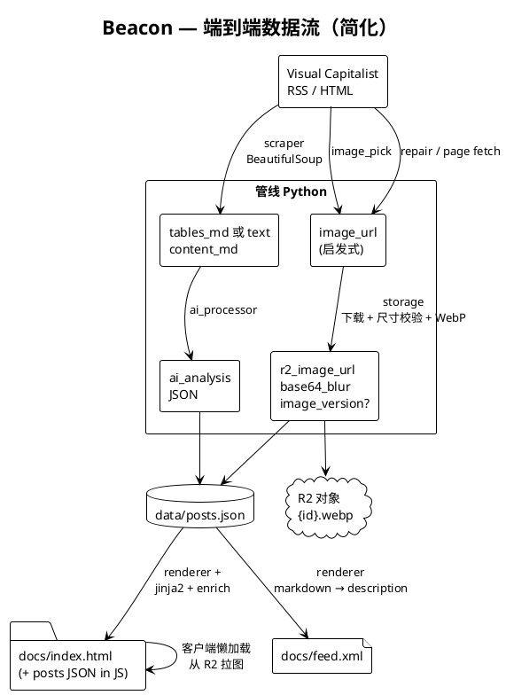
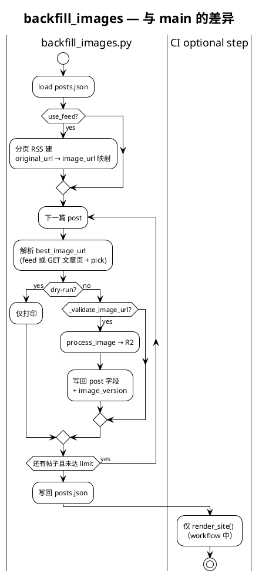
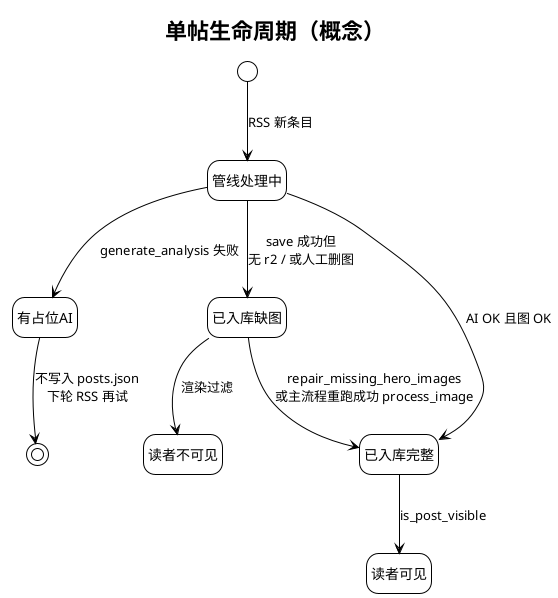

# Beacon 架构与流程（PlantUML）

本文与 [blueprint.md](./blueprint.md) 互补：侧重**代码级**模块关系、流水线顺序、数据门禁与前端动线。图均基于当前仓库实现（`src/`、`templates/`、`.github/workflows/`、`Dockerfile`）。

**Mermaid 同构版**：[architecture-mermaid.md](./architecture-mermaid.md)（便于 GitHub / VS Code 直接预览）。

**如何渲染**：将下列 ` ```plantuml ` 代码块复制到支持 PlantUML 的编辑器（如 VS Code + PlantUML 插件）、或 [plantuml.com](https://www.plantuml.com/plantuml)、本地 `plantuml.jar` 生成 PNG/SVG。

---

## 1. 系统上下文（C4 风格）

外部参与者与 Beacon 的数据出入口。



---

## 2. 部署与仓库产物（CI / Docker）

与 `.github/workflows/beacon.yml`、`Dockerfile` 一致：默认镜像入口为 **`src/main.py`**；`data/`、`docs/` 通过卷挂载回仓库以便 `git-auto-commit`。



---

## 3. Python 组件依赖（模块级）

`main.py` 为编排入口；`image_pick` 被 `scraper`、`main`（补图）、`backfill_images` 共用；`renderer` 提供 **`has_valid_ai_analysis` / `has_valid_hero_image` / `is_post_visible`** 供管线与渲染共用逻辑。

```plantuml
@startuml beacon-components
!theme plain
skinparam componentStyle rectangle
skinparam shadowing false

title Beacon — src 组件与依赖

package "编排" {
  [main.py] as Main
}

package "抓取与解析" {
  [scraper.py] as Scraper
  [image_pick.py] as ImgPick
}

package "媒体与存储" {
  [storage.py] as Storage
}

package "AI" {
  [ai_processor.py] as AI
}

package "静态输出" {
  [renderer.py] as Renderer
}

package "运维脚本" {
  [backfill_images.py] as Backfill
}

database "data/posts.json" as JSON
folder "templates/\nindex.jinja2" as Tpl
folder "docs/\nindex.html feed.xml" as Docs

Main --> Scraper
Main --> Storage
Main --> AI
Main --> ImgPick
Main --> Renderer
Main --> JSON

Scraper --> ImgPick
Scraper --> Scraper : feedparser\nBeautifulSoup

Backfill --> ImgPick
Backfill --> Storage
Backfill --> JSON

Renderer --> JSON
Renderer --> Tpl
Renderer --> Docs

AI --> AI : OpenAI client\njson_object

Storage --> Storage : requests 下载\nPillow 尺寸门槛\nWebP 上传 R2

note bottom of Renderer
  **可见性**
  is_post_visible =
  有效 AI 且非占位 core_insight
  且 r2_image_url 非空
end note

@enduml
```

---

## 4. 主管线时序（`main.main` 逐步）

严格对应代码顺序：**加载 JSON → 补主图 → 计算 existing_urls → RSS 分页拉新 → 逐条处理 → 去重 → 持久化门禁 → 渲染**。



---

## 5. 文章级图片 URL 决策（`scraper._get_image_url`）

与 `scraper.py` 实现顺序一致。



---

## 6. `storage.process_image` 内部



---

## 7. 帖子数据：持久化 vs 展示（两道门禁）

`posts.json` 可含「有 AI、暂无主图」的条目（补图或人工删字段后的状态）；**首页与 RSS** 仅展示 **`is_post_visible`**。占位分析 **`INVALID_AI_CORE_INSIGHT`** 不会写入 `publishable`。



---

## 8. 读者端动线（`templates/index.jinja2` + 内联 JS）

服务端已过滤 **`is_post_visible`**，嵌入的 `const posts = …` 仅含可见帖。动线为**纯前端**、无自有后端 API。



---

## 9. 数据流总览（端到端）



---

## 10. 独立工作流：批量换图（`backfill_images.py`）

与主管线分离：不写 OpenAI；可 `--dry-run`、`--limit`、`--no-feed`；成功时可能写入 `source_image_url`（主管线不依赖该字段）。



---

## 11. 单帖状态（概念模型）

非正式状态机，便于理解「为何 JSON 里有条但首页没有」。



---

## 维护说明

| 变更类型 | 请同步更新 |
|----------|------------|
| 新增模块 / 调整 import | 第 3、4 节 |
| 改管线顺序或门禁条件 | 第 4、7、11 节 |
| 改 CI / Docker CMD | 第 2 节 |
| 改前端交互 | 第 8 节 |
| 改抓取或 R2 逻辑 | 第 5、6、9、10 节 |

若 PlantUML 对中文参与者渲染异常，可在图首增加：`skinparam defaultFontName Microsoft YaHei`（或本机已装中文字体名）。
